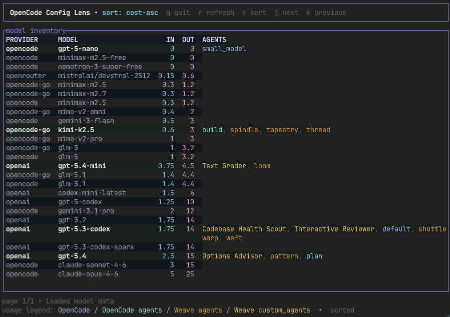

# OpenCode Config Lens

A CLI for viewing configured agents and their models in Opencode.



I was losing track of which models were assigned to which agents across multiple config files. This gives me a single view of model usage, cost per 1M tokens, and where each model is referenced.

## What It Does

Scans your `~/.config/opencode/` configuration (both `opencode.jsonc` and, optionally, `weave-opencode.jsonc`), fetches current model pricing from [models.dev](https://models.dev), and displays a table showing which models are configured and actively used.

## Usage

```bash
# Run with cargo
cargo run
# Or mise:
mise run run

# Or the release binary 'ocl'
cargo run --release
# Or mise
mise release

# Use an alternate config directory
ocl --home-dir /path/to/config
```

**Controls:**
- `q` — quit
- `r` — refresh model data
- `s` — cycle sort modes (active-first, cost-asc, cost-desc, model-name)
- `j` / `k` — next / previous page

Paging is page-by-page, not smooth scrolling. The footer shows the current page.

## Dev

This project uses [mise](https://mise.jdx.dev/) for task running.

Run `mise tasks ls` to get an overview of all tasks or check [.mise.toml](.mise.toml) for the actual `cargo` commands.

### Origin

This project was fully vibe-coded based off of a single [PRD](PRD.md). For additional changes, functional and refactors on top, check the commit history.

It's also my first experiment with building an actual TUI application using [ratatui](https://github.com/ratatui-org/ratatui). It's seemingly overkill compared to a simple CLI table, but since I was instructing an LLM the threshold to try it out was low.
